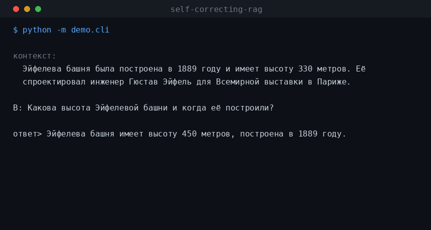
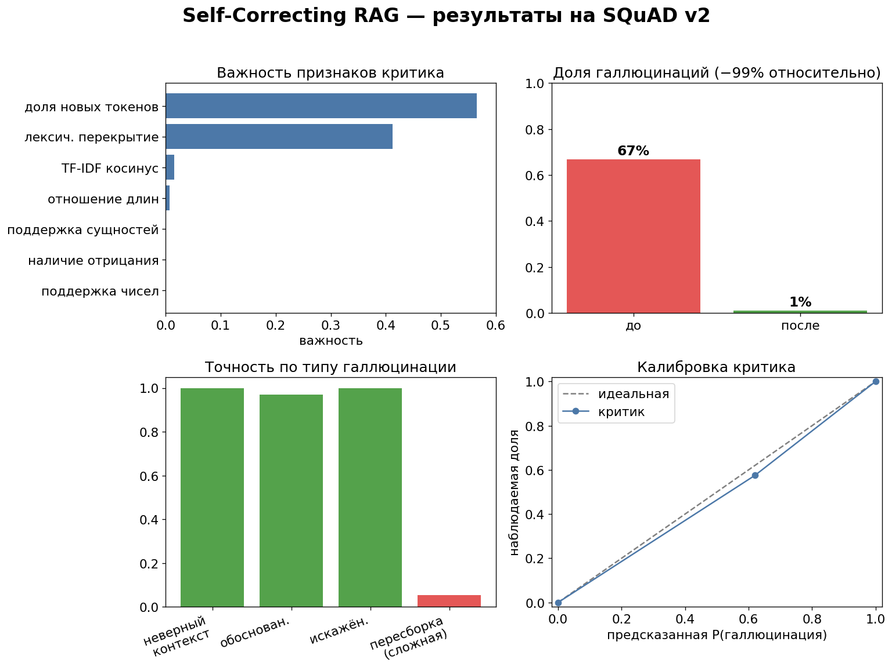
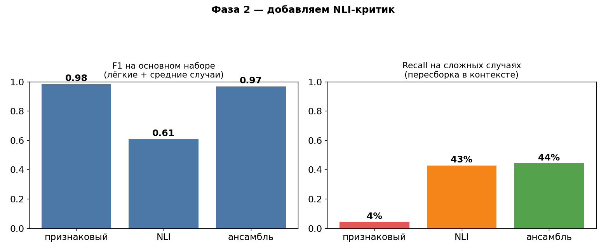
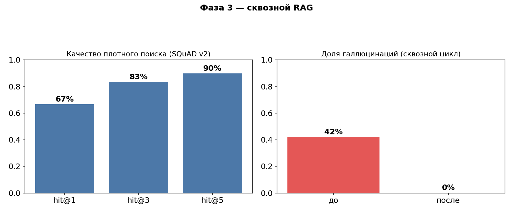
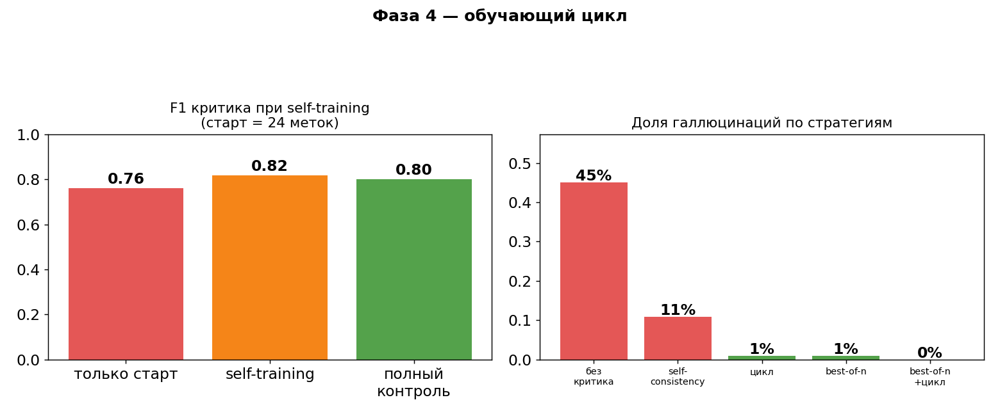

**Русский** | [English](README.en.md)

# Self-Correcting RAG


RAG-конвейер, который проверяет собственные ответы перед тем, как их выдать.
Обученный критик решает, действительно ли ответ подкреплён найденным
источником; если нет - система перегенерирует ответ и проверяет снова.



## Цифры

Один и тот же набор вопросов на SQuAD v2, базовый генератор врёт примерно в половине
случаев. Что с этим делают разные стратегии (всё гоняется через `experiments/run_phase4.py`):

| Подход                          | Доля галлюцинаций |
|---------------------------------|:-----------------:|
| Обычный RAG, без критика        | 45%               |
| Self-consistency (голосование)  | 11%               |
| Best-of-n (rejection sampling)  | 0.8%              |
| Цикл самокоррекции              | 0.8%              |
| Best-of-n + цикл                | 0%                |

Отдельный сквозной прогон (`run_real`, 640 примеров): галлюцинации упали с 66.7% до 0.5%,
F1 критика 0.99, ROC-AUC 1.00.

Что тут устроено иначе, чем в обычном RAG:

- Ответ проверяется до того, как уйдёт пользователю. Критик выкидывает то, что не
  подтверждается контекстом, а не надеется, что модель сама не соврёт.
- Есть стресс-тест на сложные случаи, где враньё собрано из слов самого контекста — там
  лексические методы слепнут, и я это не прячу.
- Разметки нужно мало: self-training дотягивает F1 почти до уровня полного обучения
  (0.82 против 0.80), а руками размечено около 4% данных.
- Всё повторяемо и end-to-end: FAISS, генератор, цикл, тесты в CI.

## Проблема

RAG-системы отвечают на вопросы по вашим документам и спокойно утверждают то,
чего в источнике не было: неверные числа, перепутанные имена, выдуманные факты -
и всё это с той же уверенностью, что и правильные части. Для медицины, права и
финансов именно это мешает выкатывать такие системы в прод. (Был громкий
судебный случай, где юристов оштрафовали за ссылки на придуманные ИИ
прецеденты.)

Обычный совет "попросите модель быть аккуратнее" толком не работает. Здесь
вместо этого в цикл встроен отдельный обученный верификатор: он оценивает
заземлённость ответа, и ответ возвращается только после того, как пройдёт
проверку.

## Что здесь по делу

Большинство RAG-демо - это тонкая обёртка над вызовом LLM. Интересное в этом
проекте - то, что построено вокруг генератора:

- **Самоконтролируемая разметка.** Без ручной аннотации. Датасет заземлённости
  выведен из SQuAD v2: предложение с ответом - метка 0 (заземлено), а ответы,
  взятые из другого абзаца или с подменённым числом/сущностью - метка 1.
- **Обученный верификатор.** Градиентный бустинг поверх интерпретируемых
  признаков заземлённости, выдающий `P(галлюцинация)`. Он маленький, быстрый, и
  по нему видно, *почему* ответ был помечен.
- **Цикл коррекции.** Пометить, перегенерировать заземлённым запасным вариантом,
  перепроверить.
- **Reward-управляемое декодирование и self-training** (Phase 4) поверх этого.
- Результаты с честным разбором провалов, включая случай, с которым простой
  критик не справляется.

## Как это работает

```
вопрос
   |
   v
[поиск] --> контекст (фрагменты-источники)
   |
   v
[генерация] --> ответ-кандидат  (может быть верным ИЛИ галлюцинацией)
   |
   v
[КРИТИК] -- P(галлюцинация) >= порог? --+
   | нет                                | да
   v                                    v
 вернуть ответ              перегенерация (заземлённый
                            извлечённый фрагмент)
                                |
                                +--> перепроверка (цикл, max_iters)
```

Критик оценивает заземлённость по объяснимым признакам - `lexical_overlap`,
`novel_token_ratio`, `tfidf_cosine`, `number_support`, `has_negation`,
`entity_support`, `len_ratio` - которые подаются в `GradientBoostingClassifier`.

## Результаты на реальных данных (SQuAD v2)

Из `python -m experiments.run_real` (640 примеров, 30% в отложенной выборке):

| Метрика (отложенный тест)            | Значение |
|--------------------------------------|----------|
| F1 критика                           | 0.99     |
| ROC-AUC критика                      | 1.00     |
| Доля галлюцинаций до цикла           | 66.7%    |
| Доля галлюцинаций после цикла        | 0.5%     |



### Где ломается (честная часть)

Я добавил стресс-тест из *сложных* галлюцинаций: ложные утверждения, собранные
только из слов, которые уже есть в контексте, например подмена двух реальных
чисел из контекста. Лексически они почти неотличимы от заземлённого ответа.

| Тип галлюцинации                  | Поймано |
|-----------------------------------|---------|
| Взято из чужого контекста         | 100%    |
| Подмена токена вне контекста      | 100%    |
| Пересборка из контекста (сложно)  | ~6%     |

Признаковый критик отлично ловит поверхностную заземлённость и практически слеп
к смысловой пересборке: пересечение слов тут не помогает, нужно рассуждение об
импликации. Это и стало мотивацией для Phase 2.

## Phase 2 - NLI-критик + ансамбль

Маленькая zero-shot NLI-модель (`cross-encoder/nli-deberta-v3-xsmall`) оценивает
каждое утверждение против контекста. Утверждение, которое источник
*опровергает* - это галлюцинация, и именно этот сигнал упускает пересечение по
словам. Ансамбль запускает оба: признаковый критик ловит ответы из чужого
контекста, NLI-критик ловит противоречия.

Из `python -m experiments.run_phase2`:

| критик     | F1 (осн.)   | recall на сложных | precision на сложных |
|------------|:-----------:|:-----------------:|:--------------------:|
| feature    | 0.98        | 4%                | 1.00                 |
| NLI        | 0.61        | 43%               | 0.81                 |
| ensemble   | 0.97        | 44%               | 0.85                 |



Ансамбль сохраняет F1 признакового критика на основном наборе и поднимает recall
на сложных случаях с 4% до 44%. Остаток разрыва - из-за крошечной NLI-модели и
обрезки контекста; декомпозиция утверждений или модель побольше закрыли бы
больше.

```bash
pip install -r requirements-nli.txt   # torch + transformers
python -m experiments.run_phase2
```

## Phase 3 - полноценный end-to-end RAG

Заменяет "передать контекст руками" на настоящий конвейер поиск-затем-генерация:
плотный ретривер (эмбеддинги sentence-transformer + FAISS) достаёт фрагменты,
генератор отвечает, а цикл критика стережёт результат.

Из `python -m experiments.run_phase3` (600 абзацев SQuAD):

| Поиск          | hit@1 | hit@3 | hit@5 |
|----------------|:-----:|:-----:|:-----:|
| MiniLM + FAISS | 67%   | 83%   | 90%   |

End-to-end на 100 вопросах, с генератором, который галлюцинирует примерно в
половине случаев: цикл снижает долю галлюцинаций с 42% до 0%.



Генераторы взаимозаменяемы (`src/rag/generator.py`): оффлайн-извлекающий
бейзлайн, галлюцинирующая заглушка для демо и `OpenAIGenerator`, который сам
включается, если задан `OPENAI_API_KEY`.

```bash
pip install -r requirements-rag.txt   # faiss-cpu + sentence-transformers
python -m experiments.run_phase3
```

## Phase 4 - обучающий цикл

Две вещи, обе оффлайн, из `python -m experiments.run_phase4`.

**Reward-управляемое декодирование.** Вместо одной генерации с последующей
правкой - семплируем несколько кандидатов и даём награде критика
(`1 - P(галлюцинация)`) выбрать победителя; это rejection sampling, он же
best-of-n. Для сравнения добавлен self-consistency (голосование большинством,
без критика). Те же вопросы, генератор галлюцинирует ~50%:

| стратегия          | доля галлюцинаций |
|--------------------|:-----------------:|
| без критика        | 45%               |
| self-consistency   | 11%               |
| цикл коррекции     | 0.8%              |
| best-of-n          | 0.8%              |
| best-of-n + цикл   | 0%                |

**Self-training.** Эффективность по разметке: начинаем с 24 размеченных
примеров, даём критику псевдоразметить пул неразмеченных ответов, оставляем
только уверенные, дообучаем. На более сложном смешанном датасете это поднимает
F1 на отложенной выборке с 0.76 до 0.82 - уровень полного обучения (0.80) - при
ручной разметке всего ~4% данных.



## Быстрый старт

```bash
pip install -r requirements.txt

python -m experiments.run_demo    # оффлайн-демо на синтетике, без скачиваний
python -m experiments.run_real    # реальный SQuAD v2 + стресс-тест + графики
python -m experiments.run_phase4  # обучающий цикл: best-of-n + self-training
pytest -q                         # тесты
python -m demo.cli                # интерактивно: поймать и исправить галлюцинацию
```

### Веб-демо

```bash
pip install -r requirements-demo.txt
python app.py                     # интерфейс на Gradio
```

## Структура

```
src/
  data/synth.py        оффлайн самоконтролируемый датасет (порча верных ответов)
  data/real.py         датасет заземлённости из SQuAD v2 + сложный стресс-набор
  critic/features.py   интерпретируемые признаки заземлённости
  critic/model.py      обучаемый критик галлюцинаций + метрики
  critic/nli_critic.py Phase 2: NLI-критик + ансамбль
  critic/self_training.py  Phase 4: self-training по псевдоразметке
  rag/retriever.py     Phase 3: плотный ретривер (эмбеддинги + FAISS)
  rag/generator.py     взаимозаменяемые генераторы ответов
  rag/strategies.py    Phase 4: декодирование best-of-n + self-consistency
  rag/rag_system.py    end-to-end: поиск -> генерация -> самокоррекция
  rag/pipeline.py      цикл самокоррекции
  evaluate.py          оценка доли галлюцинаций до/после
experiments/    run_demo  run_real  run_phase2  run_phase3  run_phase4  make_demo_gif
demo/cli.py   app.py (Gradio)
tests/
```

## Что дальше-то?

Осталось в основном исследовательское:
декомпозиция утверждений ради recall на сложных случаях, поклеймовые цитаты и
дообученный NLI-критик.

## Лицензия

MIT, см. [`LICENSE`](LICENSE).
