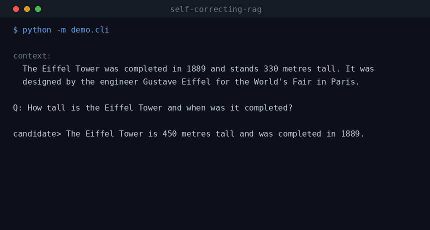
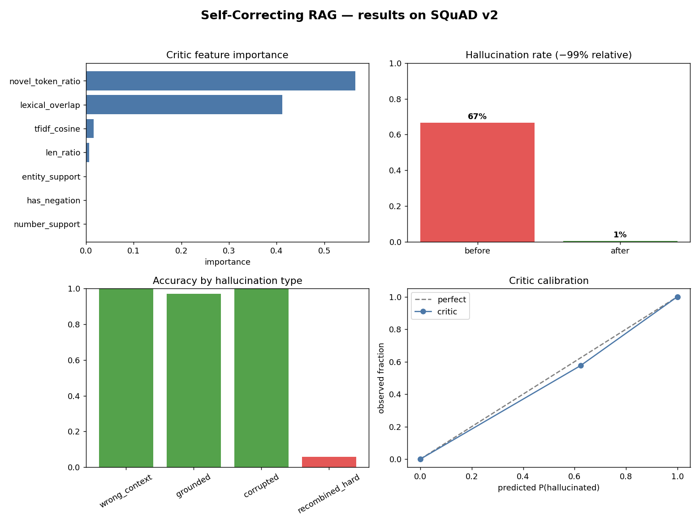
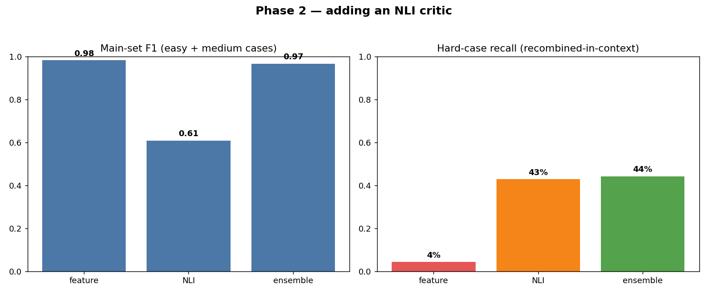
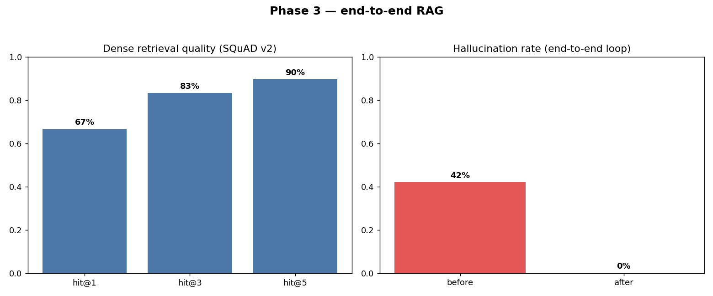
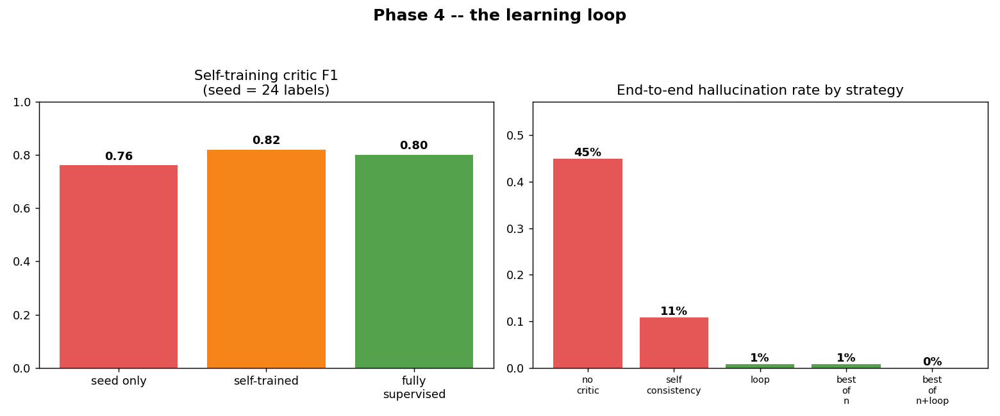

# Self-Correcting RAG


A retrieval-augmented generation pipeline that checks its own answers before
returning them. A trained critic decides whether each answer is actually
supported by the retrieved source; if it isn't, the system regenerates and
checks again.



## The problem

RAG systems answer questions over your documents, and they will happily state
things the source never said: wrong numbers, swapped names, invented claims,
all delivered with the same confidence as the correct parts. For medicine, law
or finance that is the thing stopping people from shipping. (There was a
well-publicised court case where lawyers got fined for citing AI-invented
precedents.)

The usual fix is "prompt the model to be careful", which doesn't really work.
This project instead puts a separate, trained verifier in the loop: score the
grounding, and only return an answer once it passes.

## What's actually in here

Most RAG demos are a thin wrapper around an LLM call. The interesting parts of
this one are the pieces around the generator:

- **Self-supervised labels.** No hand annotation. The grounding dataset is
  derived from SQuAD v2: the answer sentence is label 0 (grounded), and answers
  borrowed from a different passage or with a swapped number/entity are label 1.
- **A trained verifier.** A gradient-boosted classifier over interpretable
  grounding features that outputs `P(hallucinated)`. It's small, fast and you
  can read off *why* it flagged something.
- **A correction loop.** Flag, regenerate with a grounded fallback, re-check.
- **Reward-guided decoding and self-training** (Phase 4) on top of that.
- Results with an honest failure analysis, including the case the simple critic
  can't handle.

## How it works

```
question
   |
   v
[retrieve] --> context (source passages)
   |
   v
[generate] --> candidate answer  (may be grounded OR hallucinated)
   |
   v
[CRITIC] -- P(hallucinated) >= threshold? --+
   | no                                     | yes
   v                                        v
 return answer                     regenerate (grounded
                                    extractive fallback)
                                        |
                                        +--> re-check (loop, max_iters)
```

The critic scores grounding from explainable features - `lexical_overlap`,
`novel_token_ratio`, `tfidf_cosine`, `number_support`, `has_negation`,
`entity_support`, `len_ratio` - fed to a `GradientBoostingClassifier`.

## Results on real data (SQuAD v2)

From `python -m experiments.run_real` (640 examples, 30% held out):

| Metric (held-out test)             | Value |
|------------------------------------|-------|
| Critic F1                          | 0.99  |
| Critic ROC-AUC                     | 1.00  |
| Hallucination rate before the loop | 66.7% |
| Hallucination rate after the loop  | 0.5%  |



### Where it breaks (the honest part)

I added a stress test of *hard* hallucinations: false claims built only from
words that already appear in the context, e.g. swapping two real in-context
numbers. Lexically these look almost identical to a grounded answer.

| Hallucination type             | Caught |
|--------------------------------|--------|
| Borrowed from wrong context    | 100%   |
| Out-of-context token swap      | 100%   |
| Recombined in-context (hard)   | ~6%    |

The feature critic is great at surface grounding and basically blind to
semantic recombination, because word overlap can't tell those apart - you need
entailment reasoning. That's what motivated Phase 2.

## Phase 2 - NLI critic + ensemble

A small zero-shot NLI model (`cross-encoder/nli-deberta-v3-xsmall`) scores each
claim against the context. A claim the source *contradicts* is a hallucination,
which is exactly the signal lexical overlap misses. The ensemble runs both: the
feature critic catches wrong-context answers, the NLI critic catches
contradictions.

From `python -m experiments.run_phase2`:

| critic     | main-set F1 | hard-case recall | hard precision |
|------------|:-----------:|:----------------:|:--------------:|
| feature    | 0.98        | 4%               | 1.00           |
| NLI        | 0.61        | 43%              | 0.81           |
| ensemble   | 0.97        | 44%              | 0.85           |



The ensemble keeps the feature critic's main-set F1 and pulls hard-case recall
from 4% to 44%. The rest of the gap is down to the xsmall NLI model plus context
truncation; claim decomposition or a bigger model would close more.

```bash
pip install -r requirements-nli.txt   # torch + transformers
python -m experiments.run_phase2
```

## Phase 3 - real end-to-end RAG

Replaces "pass the context in by hand" with an actual retrieve-then-generate
pipeline: a dense retriever (sentence-transformer embeddings + FAISS) pulls
passages, a generator answers, and the critic loop guards the output.

From `python -m experiments.run_phase3` (600 SQuAD passages):

| Retrieval      | hit@1 | hit@3 | hit@5 |
|----------------|:-----:|:-----:|:-----:|
| MiniLM + FAISS | 67%   | 83%   | 90%   |

End-to-end on 100 questions, with a generator that hallucinates about half the
time, the loop cuts the hallucination rate from 42% to 0%.



Generators are swappable (`src/rag/generator.py`): an offline extractive
baseline, a hallucinating stub for the demo, and an `OpenAIGenerator` that turns
on automatically when `OPENAI_API_KEY` is set.

```bash
pip install -r requirements-rag.txt   # faiss-cpu + sentence-transformers
python -m experiments.run_phase3
```

## Phase 4 - the learning loop

Two things, both offline, from `python -m experiments.run_phase4`.

**Reward-guided decoding.** Instead of generating once and patching afterwards,
sample several candidates and let the critic reward (`1 - P(hallucinated)`) pick
the winner - rejection sampling, a.k.a. best-of-n. Self-consistency (majority
vote, no critic) is included as a baseline. Same questions, generator
hallucinating ~50%:

| strategy           | hallucination rate |
|--------------------|:------------------:|
| no critic          | 45%                |
| self-consistency   | 11%                |
| correction loop    | 0.8%               |
| best-of-n          | 0.8%               |
| best-of-n + loop   | 0%                 |

**Self-training.** Label efficiency: start from 24 labelled examples, let the
critic pseudo-label a pool of unlabelled answers, keep only the confident ones,
refit. On the harder mixed dataset this lifts held-out F1 from 0.76 to 0.82,
matching the fully-supervised ceiling (0.80) while hand-labelling ~4% of the
data.



## Quickstart

```bash
pip install -r requirements.txt

python -m experiments.run_demo    # offline synthetic demo, no downloads
python -m experiments.run_real    # real SQuAD v2 + stress test + plots
python -m experiments.run_phase4  # learning loop: best-of-n + self-training
pytest -q                         # tests
python -m demo.cli                # interactive: catch and fix a hallucination
```

### Web demo

```bash
pip install -r requirements-demo.txt
python app.py                     # Gradio UI
```

## Layout

```
src/
  data/synth.py        offline self-supervised dataset (corrupt faithful answers)
  data/real.py         SQuAD v2 grounding dataset + hard stress set
  critic/features.py   interpretable grounding features
  critic/model.py      trainable hallucination critic + metrics
  critic/nli_critic.py Phase 2: NLI critic + ensemble
  critic/self_training.py  Phase 4: pseudo-label self-training
  rag/retriever.py     Phase 3: dense retriever (embeddings + FAISS)
  rag/generator.py     swappable answer generators
  rag/strategies.py    Phase 4: best-of-n + self-consistency decoding
  rag/rag_system.py    end-to-end retrieve -> generate -> self-correct
  rag/pipeline.py      the self-correction loop
  evaluate.py          before/after hallucination-rate evaluation
experiments/    run_demo  run_real  run_phase2  run_phase3  run_phase4  make_demo_gif
demo/cli.py   app.py (Gradio)
tests/
```

## Roadmap

See [`ROADMAP.md`](ROADMAP.md). Phases 1-4 are done (real data, NLI critic,
end-to-end RAG, the learning loop). What's left is mostly research-y: claim
decomposition to push hard-case recall, per-claim citations, and a fine-tuned
NLI critic.

## License

MIT, see [`LICENSE`](LICENSE).
